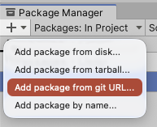
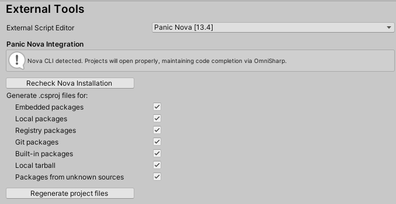

# OmniSharp - C# for Nova

This extension provides language support for C# (and helpful options for using with Unity) using [OmniSharp Roslyn](https://github.com/OmniSharp/omnisharp-roslyn) with the [V1.39.14 release](https://github.com/OmniSharp/omnisharp-roslyn/releases/) to try an do this LSP magic.

It provides for C#:

 * **Syntax highlighting**
 * **Symbols**

If you have a Nova project, which contains the `*.sln` or `*.csproj` file, this extension will also provide:

 * **Language intelligence**
   * Issues
   * Completions. (Requires Nova 11.3+. Nova 11.4+ formats it better)

In order for the language intelligence part, you need that `*.sln` or `*.csproj` file. This is part of the design of Omnisharp.

It is highly recommended to use the Unity package below, especially with Unity 202x version since it will allow you to generate proper `*.csproj`.

## Notes

I am primarily focused on using it for work with Unity projects, so for right now it's using some options that will only work for Unity project and some basic .NET project may not work as expected. It also seems after Unity 2019, the Visual Studio Code updates changed the `.csproj` and they don't really work well.

Syntaxes were converted with [Nova Mate](https://github.com/gredman/novamate) from the grammar `csharp` in [Microsoft's VSCode C# Extension](https://github.com/microsoft/vscode/blob/main/extensions/csharp/syntaxes/csharp.tmLanguage.json) and I basically added some `<symbol>` to get the outlining features to work.

Larger Unity projects, with a lot of packages or assets, may take a long time (several minutes) for Omnisharp to process before code completion starts to work. Please be patient!

## Ominsharp release modification

While you can change setting to use a different omnisharp release, for this extension I modify the `run` file of the package **omnisharp-osx** to help handle spacing in the name of the path. I add `:q` to the variables for `base_dir`,`omnisharp_dir` and to creating the `omnisharp_cmd`.

## Known Issues

* Does not honor all the OmniSharp options properly.

## Requirements

- The complete install of **[Mono](https://www.mono-project.com/download/stable/) (including MSBuild)** in order to provide the language services.

- A version of **[.NET SDK](https://dotnet.microsoft.com/en-us/download)**

- **Nova Command Line Tools**

   - Go to **Nova** -> **Settings...** and click on the **Tools** item
   - If **Command Line Tool** says "Install", click on it to install it.

- **A Unity/Nova connection** - See below about **[com.unity.ide.nova](https://gitlab.com/AmigaAbattoir/com.unity.ide.nova) Unity Package** or **"Unity Nova"**

## Usage

OmniSharp for Nova should runs any time you open a file with ".cs" files, or if there is a "*.csproj" file in the workspace.

## Configuration

While configuration options are there, not all are "hooked up" or work as expected. Still working on that.

## Unity/Nova Connections

One of these will be required to get Unity to open file properly. Both can be installed, but for Unity 2020+, using the Package is recommended:

### com.unity.ide.nova Package

This is recommended for Unity 2020+. Add in this package to Unity will be able to open files in Unity. And also regenerate `*.sln` and `*.csproj` so that you will start to get code completion.

- In your Unity project go to *Windows -> Package Manager*

- Then click the "+" and select *Add package from git URL*



- Enter the git URL: `https://gitlab.com/AmigaAbattoir/com.unity.ide.nova.git`

- Then go into *Unity -> Settings* and select the *External Tools* option



This should detect Nova, as long as the Nova Command Line Tools are installed! If you forgot, click the *Recheck Nova Installation*. It is recommended to *Regenerate project files*, especially if you (or someone on your team) were using VSCode.

### "Unity Nova"

This is recommended for Unity 2019 and below. To use Nova and this extension with a Unity project, you **need** to add a project to Nova with either in the root of the Unity project's folder or the parent folder.

To setup Unity to use Nova as your editor, you'll need to use the **UnityNova** executable to launch Nova with the right parameters.
Unity will send a line or column of zero, depending where it's called from.
Nova isn't happy with that so this program will handle passing parameters to Nova that it will know either to just open a file, go to a particular line, or to go to a line and column of a file.

*NOTE:* Still working on making the extension install it. Right now, it will show a notification with a command to copy and paste in Terminal.
You could probably go through Finder and Show Package Content to get to the same location:

`~/Library/Application Support/Nova/Extensions/Omnisharp.novaextension/UnityNova`

Once UnityNova is installed, go in Unity and go into the *Settings -> External Tools*

Change them as follows:

  * **External Script Editor:** *Select UnityNova*

    * _@TODO_ Figure out how to copy to /usr/local/bin

  * **External Script Editor Args:** *"$(File)" $(Line) $(Column)*

*NOTE:* It is important to use the double quotes around `$(File)` to ensure that if the path contains spaces the command will work.

## Additional Notes for Unity:

To make this work nicely for Unity projects, right now, we add in the following environmental variable and options automatically if using the **Auto Detect Unity project** setting (enabled by default):

```
FrameworkPathOverride=/Library/Frameworks/Mono.framework/Versions/Current
```

and add these options when starting up the OmniSharp LSP for the project:

```
omnisharp.useModernNet:false
omnisharp.useGlobalMono:always
```


<!--
### What happens?

Who knows... but here's some notes for me...

Take a look at:

`~/.vscode/extensions/ms-dotnettools.csharp-1.25.0-darwin-arm64/.omnisharp/1.39.0/omnisharp/`

Default [RoslynExtensionOptions](https://github.com/OmniSharp/omnisharp-roslyn/blob/master/src/OmniSharp.Shared/Options/RoslynExtensionsOptions.cs)

```
{
	"RoslynExtensionsOptions":{
		"EnableDecompilationSupport":false,
		"EnableAnalyzersSupport":false,
		"EnableImportCompletion":false,
		"EnableAsyncCompletion":false,
		"DocumentAnalysisTimeoutMs":30000,
		"DiagnosticWorkersThreadCount":15,
		"AnalyzeOpenDocumentsOnly":false,
		"InlayHintsOptions":{
			"EnableForParameters":false,
			"ForLiteralParameters":false,
			"ForIndexerParameters":false,
			"ForObjectCreationParameters":false,
			"ForOtherParameters":false,
			"SuppressForParametersThatDifferOnlyBySuffix":false,
			"SuppressForParametersThatMatchMethodIntent":false,
			"SuppressForParametersThatMatchArgumentName":false,
			"EnableForTypes":false,
			"ForImplicitVariableTypes":false,
			"ForLambdaParameterTypes":false,
			"ForImplicitObjectCreation":false
		},
		"LocationPaths":null
	},
	"FormattingOptions":{
		"OrganizeImports":false,
		"EnableEditorConfigSupport":false,
		"NewLine":"\\n",
		"UseTabs":false,
		"TabSize":4,
		"IndentationSize":4,
		"SpacingAfterMethodDeclarationName":false,
		"SeparateImportDirectiveGroups":false,
		"SpaceWithinMethodDeclarationParenthesis":false,
		"SpaceBetweenEmptyMethodDeclarationParentheses":false,
		"SpaceAfterMethodCallName":false,
		"SpaceWithinMethodCallParentheses":false,
		"SpaceBetweenEmptyMethodCallParentheses":false,
		"SpaceAfterControlFlowStatementKeyword":true,
		"SpaceWithinExpressionParentheses":false,
		"SpaceWithinCastParentheses":false,
		"SpaceWithinOtherParentheses":false,
		"SpaceAfterCast":false,
		"SpaceBeforeOpenSquareBracket":false,
		"SpaceBetweenEmptySquareBrackets":false,
		"SpaceWithinSquareBrackets":false,
		"SpaceAfterColonInBaseTypeDeclaration":true,
		"SpaceAfterComma":true,
		"SpaceAfterDot":false,
		"SpaceAfterSemicolonsInForStatement":true,
		"SpaceBeforeColonInBaseTypeDeclaration":true,
		"SpaceBeforeComma":false,
		"SpaceBeforeDot":false,
		"SpaceBeforeSemicolonsInForStatement":false,
		"SpacingAroundBinaryOperator":"single",
		"IndentBraces":false,
		"IndentBlock":true,
		"IndentSwitchSection":true,
		"IndentSwitchCaseSection":true,
		"IndentSwitchCaseSectionWhenBlock":true,
		"LabelPositioning":"oneLess",
		"WrappingPreserveSingleLine":true,
		"WrappingKeepStatementsOnSingleLine":true,
		"NewLinesForBracesInTypes":true,
		"NewLinesForBracesInMethods":true,
		"NewLinesForBracesInProperties":true,
		"NewLinesForBracesInAccessors":true,
		"NewLinesForBracesInAnonymousMethods":true,
		"NewLinesForBracesInControlBlocks":true,
		"NewLinesForBracesInAnonymousTypes":true,
		"NewLinesForBracesInObjectCollectionArrayInitializers":true,
		"NewLinesForBracesInLambdaExpressionBody":true,
		"NewLineForElse":true,
		"NewLineForCatch":true,
		"NewLineForFinally":true,
		"NewLineForMembersInObjectInit":true,
		"NewLineForMembersInAnonymousTypes":true,
		"NewLineForClausesInQuery":true
	},
	"FileOptions":{
		"SystemExcludeSearchPatterns":[
			"**/node_modules/**/*",
			"**/bin/**/*",
			"**/obj/**/*",
			"**/.git/**/*"
		],
		"ExcludeSearchPatterns":[
		]
	},
	"RenameOptions":{
		"RenameOverloads":false,
		"RenameInStrings":false,
		"RenameInComments":false
	},
	"ImplementTypeOptions":{
		"InsertionBehavior":0,
		"PropertyGenerationBehavior":0
	},
	"DotNetCliOptions":{
		"LocationPaths":null
	},
	"Plugins":{
		"LocationPaths":null
	}
}
```
-->
